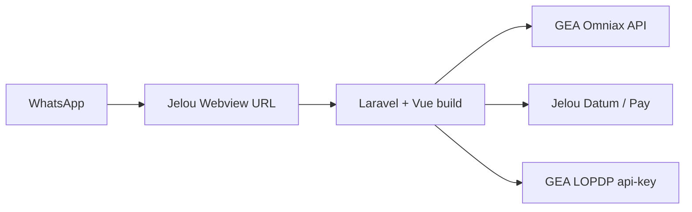

# lucy_webview — Estado del proyecto (handoff completo)

> **Palabra clave Cursor:** `lucy_webview` (alias `lucy-webview`).  
> **Repo local:** `C:\Users\alvarezdx\Documents\CURSOR\formulario_fe_lucy` (Laravel 12 + Vue 3).  
> **Push GitHub:** [[projects/lucy-webview/GITHUB-PUSH]].  
> **Jelou prod:** proyecto `01j5661e5gaf6330435zh3bzjx`. Observación local: `jelou-lucy-ecuador-observe` (no subir secretos de exports).

## Arquitectura (producción objetivo)

1. Usuario en **WhatsApp** → skill Jelou abre **webview** `https://<vps>/?telefono=593…` (opcional `&flow=aseguradora|hsm|ia`).
2. **SPA chat** (`ChatView.vue` + grafo `lucyFlowGraph.js`) — la lógica de negocio vive aquí, no en runtime Jelou en browser.
3. Laravel **proxy** `/api/v1/omniax/*`, `/api/v1/gea/tools/*`, `/api/v1/jelou/*`, `/api/v1/aseguradora/*`, `/api/v1/lucy/ia/*`.
4. Cierre: `postMessage` `jelou:webview:close` (`resources/js/lib/webviewBridge.js`) — el skill Jelou debe escuchar el evento (Fase 4).



---

## Hasta dónde llegamos (2026-09-25)

### Fases roadmap (`docs/JELOU_PARITY_ROADMAP.md`)

| Fase | Contenido | Estado |
|------|-----------|--------|
| **0** | Tools GEA: asistencia en curso, notificar cabina, validación cédula, LOPDP, menú proveedor | ✅ Backend + grafo |
| **1** | Cabina en médico/dental agendar-reagendar; reagendar menú | ✅ |
| **2** | ASAP / aseguradora (consulta placa, siniestros, inspección) | ✅ `AseguradoraAsapController` + `aseguradoraRunner` |
| **3** | Comercial: Datum, Pay, E-Doctor, venta contratar, derivación, VIP parcial | ✅ |
| **4** | Lucy IA (LLM opcional), composer IA, cierre webview | ✅ |

Grafo ~**324 nodos** — validar: `node scripts/validate_lucy_graph.mjs`.

### Integraciones y `.env` (no se suben al git)

- **`.env` está en `.gitignore`** — nunca commitear API keys.
- Catálogo: `app/Support/Integrations/IntegrationRegistry.php`.
- Middleware `integration:{nombre}` → 503 con `missing_env` si falta config.
- Diagnóstico:
  - `php scripts/check_integrations.php` (exit 1 si falta core)
  - `GET /api/v1/integrations/status`
  - `GET /api/health` → `core_ready` (omniax + lopdp)

### Auth / teléfono (webview QA vs WhatsApp)

- **Producción WhatsApp:** `?telefono=` en URL → se omite el paso manual.
- **Pruebas en browser:** paso **`auth_telefono`** → cédula → nombre (`ChatAuthTabs.vue`, `resources/js/lib/lucyTelefono.js`). Sin teléfono real ya **no** se usa `0999999999` por defecto en el frontend (evita listados de citas de otro afiliado).
- Normalización 593↔09: `GeaPhone.php` + `lucyTelefono.js`.

### Cabina + citas médicas/dentales

- Agendar/reagendar sigue llamando **`POST /api/v1/gea/tools/notificar-cabina`** (paridad Jelou).
- Si GEA responde `asistencia_vigente` con teléfono real, antes se volvía a `menu_medico` sin agendar; **corregido:** en flujos Omniax cita (`allowVigenteForAppointments` en `cabinaGate.js`) se continúa al wizard; hogar/vial/aseguradora **sí** bloquean.

### UI chat — flujos con API real

- Omniax médico/dental: agendar, reagendar, especialidades, GPS/zona, crear, reagendar PDF servicio 12.
- GEA crear hogar/vial/ambulancia/médico domicilio + encuesta, ubicación, utilidades.
- Aseguradora ASAP, comercial (pay links simulados si falta token), IA router (`?flow=ia`).
- Stubs restantes: hojas informativas, algunos menús comerciales menores — ver `docs/HANDOFF.md` en repo.

---

## Secretos: qué necesitas y dónde conseguirlos

Copiar de **`.env.example`** a **`.env` local / VPS** (una variable por línea). **No** están en GitHub.

| Variable | Obligatorio | Dónde obtenerla |
|----------|-------------|-----------------|
| `APP_KEY` | Sí | `php artisan key:generate` en el servidor |
| `GEA_OMNIAX_CLIENT_ID` | **Core** | Credenciales Omniax GEA (mismo par que Jelou tools Auth / Auth Gea). Entorno test: base `…/test-ec` |
| `GEA_OMNIAX_CLIENT_SECRET` | **Core** | Idem |
| `GEA_OMNIAX_BASE_URL` | Sí | `https://api.geainternacional.com/test-ec` (QA) o producción `/ec` |
| `GEA_LOPDP_API_KEY` | **Core** | Jelou **Secrets** / credencial GEA para tool **2620 Aceptacion LOPDP** (header `api-key`, **no** es el Bearer Omniax). En exports de tools a veces aparece en MEMORY — rotar si se filtró |
| `GEA_LOPDP_BASE_URL` | Sí | `https://api.geainternacional.com` |
| `GEA_LOPDP_APP_NAME`, `GEA_LOPDP_CANAL` | Sí | `CHATBOT_LUCY`, `CHATBOT` (como tool Jelou) |
| `JELOU_API_TOKEN` | Opcional* | Jelou Developers → API token del proyecto (Datum: venta, derivación, IA router) |
| `JELOU_PAY_BEARER` | Opcional* | Jelou Pay / workspace (checkout comercial) |
| `JELOU_PAY_APP_ID` | Opcional* | Ya en `.env.example` (UUID app Pay) |
| `LUCY_IA_API_KEY` | Opcional | OpenAI u otro (`LUCY_IA_BASE_URL`, `LUCY_IA_MODEL`) — sin key = modo guiado |
| `GEA_JELOU_FUNCTION_USER` / `PASSWORD` | Opcional | Solo si se usa proxy legacy `functions.jelou.ai` (tool asistencia-en-curso antigua); webview usa Omniax directo |

\*Sin Datum/Pay/IA el chat core (Omniax + LOPDP) funciona; rutas comerciales/IA devuelven 503 o simulación según ruta.

**Mapa tools Jelou → env:** ver tabla en `formulario_fe_lucy/docs/HANDOFF.md` y comentarios en `.env.example`.

**Nunca subir:** `.env`, `Credenciales.txt`, exports `jelou-lucy-ecuador-observe/tools/*.json` con MEMORY quemado.

---

## Desplegar el proyecto (VPS / staging)

### Requisitos servidor

- PHP **8.2+** (extensiones: openssl, pdo, mbstring, tokenizer, xml, ctype, json, bcmath, zip)
- Composer 2, Node **20+**, npm
- HTTPS (webview en WhatsApp exige URL pública)
- SQLite OK para MVP (`DB_CONNECTION=sqlite`); producción puede usar MySQL

### Pasos deploy

```bash
git clone https://github.com/<ORG>/<REPO>.git
cd formulario_fe_lucy

cp .env.example .env
# Editar .env con secretos (tabla arriba)
composer install --no-dev --optimize-autoloader
php artisan key:generate
php artisan migrate --force   # si aplica
npm ci
npm run build
php artisan config:cache
php artisan route:cache
```

- Document root: `public/` (Nginx/Apache → `public/index.php`).
- `APP_URL=https://tu-dominio` y `APP_ENV=production`, `APP_DEBUG=false`.
- Permisos escritura: `storage/`, `bootstrap/cache/`, `database/database.sqlite` si SQLite.
- En Jelou: URL webview = `https://tu-dominio/?telefono={{user.id}}` (formato según skill).

### Verificación post-deploy

```bash
curl -s https://tu-dominio/api/health
php scripts/check_integrations.php
node scripts/validate_lucy_graph.mjs
```

QA cédula habitual: `0979461382`. Probar con `?telefono=` o paso Teléfono en web.

---

## Repo — archivos clave

| Área | Rutas |
|------|--------|
| Grafo / motor | `resources/js/flows/lucy/lucyFlowGraph.js`, `lucyChatEngine.js` |
| Omniax runners | `resources/js/flows/lucy/omniax/*` |
| GEA / cabina | `geaRunner.js`, `gea/cabinaGate.js`, `GeaToolsController.php` |
| Integraciones | `IntegrationRegistry.php`, `EnsureIntegrationConfigured.php`, `routes/api.php` |
| Teléfono QA | `resources/js/lib/lucyTelefono.js` |
| Docs pruebas | `docs/PHASE0_TEST.md` … `PHASE4_TEST.md` |

Scripts: `scripts/check_integrations.php`, `omniax_probe_gea.php`, `cabina_medico_probe.php`, `validate_lucy_graph.mjs`.

---

## Pendiente / riesgos (go-live)

1. **Skill Jelou** escuchar `jelou:webview:close` y mensaje post-cierre WhatsApp.
2. **Producción Omniax:** cambiar `GEA_OMNIAX_BASE_URL` y credenciales a `/ec`.
3. **Paridad no 100%:** VIP verify Omniax, fotos siniestro, function-calling IA, crear afiliación post-pago, algunos stubs de menú.
4. **Rotar secretos** si hubo exports de tools/workflows en chat o repos públicos.
5. **Primer push GitHub:** hay muchos cambios locales sin commit (fases 0–4 + integraciones + teléfono); ver [[projects/lucy-webview/GITHUB-PUSH]].

---

## Prompt rápido para Cursor

```text
Keyword: lucy_webview.
Lee team-brain/projects/lucy-webview/HANDOFF-CONTINUATION.md y formulario_fe_lucy/docs/HANDOFF.md.
Stack: Laravel proxy + Vue grafo Lucy → Omniax/GEA/Jelou. .env no está en git.
```

## Enlaces

- [[projects/lucy-webview/GITHUB-PUSH]]
- [[projects/lucy-webview/LEVANTAR-LARAGON]]
- [[projects/lucy-webview/overview]]
- [[projects/lucy-webview/pendiente-integracion-apis]]
